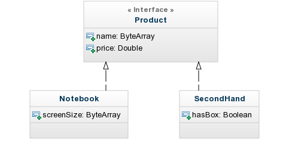
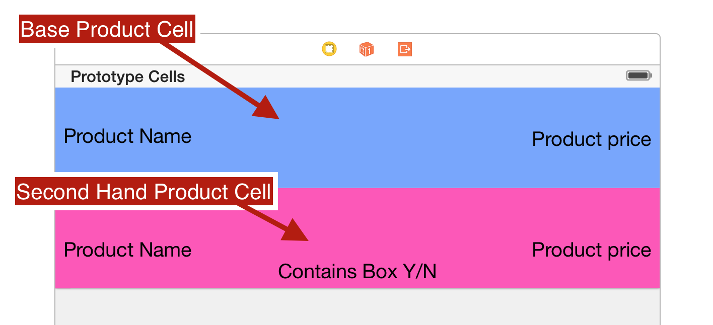

# ProductViewCodeKata
This is an exercise used to find the best solution to this question http://goo.gl/TOz7B7

## Description of the problem
This app contains a list of different types of product, all the products are subclass of the abstract class `Product`.

 
Each product should be displayed in the app using a specific UI element depends on its type.

 

Implement the best solution trying to respect all the rules of OOP, in particular avoid using  `isKindOfClass`.

## Possible approaches

Each approach is created in a specific branch. The pro/cons are explained in this README.

### Solution_01: class introspection
This is the most common -but wrong- approach. The viewcontroller uses class introspection to instantiate a specific UI object for each product type.

    id product = /* get the product from the factory */

    //check the class name
    if ([product isKindOfClass:[Notebook class]]) {
        UITableViewCell *cell = [tableView dequeueReusableCellWithIdentifier:@"BaseProductCell" forIndexPath:indexPath];
    } else {
        UITableViewCell *cell = [tableView dequeueReusableCellWithIdentifier:@"UsedProductCell" forIndexPath:indexPath];
    }

**CONS:**
This is completely against the logic of the OOP. Subclasses are created in order to encapsulate complexity and future changes of the implementation, if someone is explicitly checking the class type it will be impossible in the future replace this class with a differen one.